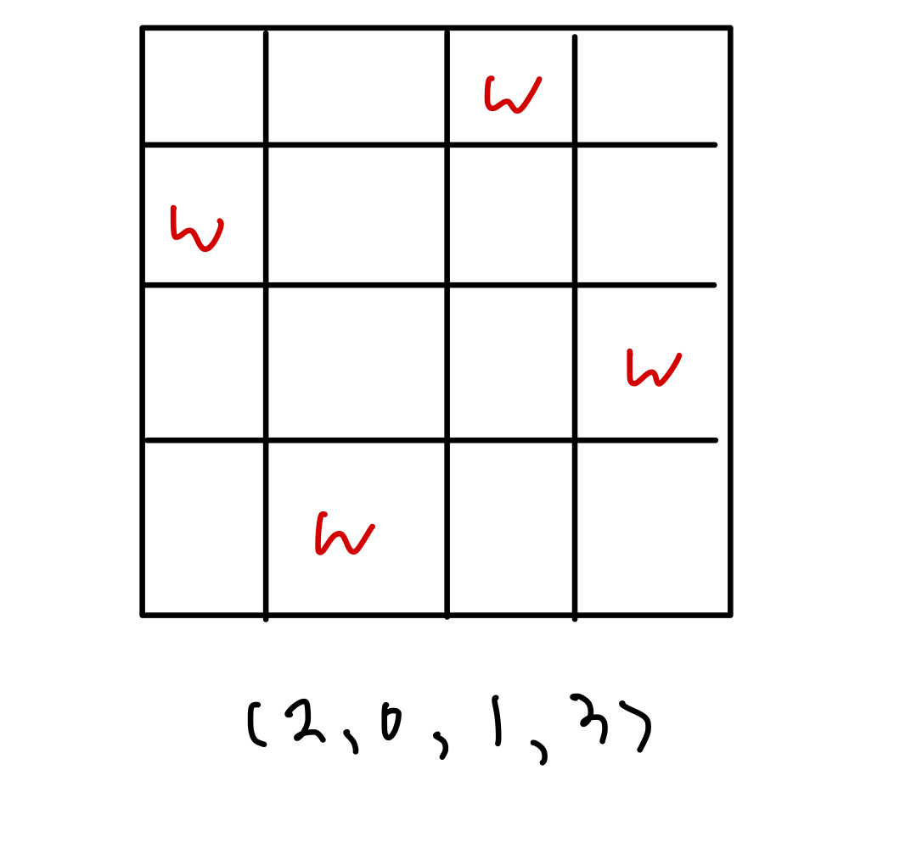

<!-- 제목으로 다음과 같은 내용으로 작성해주세요 ! -->
<!-- 📚 언어 : e.g. Javascript -> [JS], Python -> [Python]  -->
<!-- 📕 백준 : BOJ 문제번호/문제제목 e.g. BOJ 2577/숫자의 개수 -->
<!-- 📗 프로그래머스 : PRO 문제번호/문제제목 e.g. PRO 120812/최빈값 구하기 -->
<!-- 💁🏻 백준허브를 사용하시면 프로그래머스의 문제번호도 확인하실 수 있습니다 -->

# [JS] BOJ 9663/N - Queen

<!-- 아래에 # 을 지우고 문제 링크를 입력해주세요 ! -->

[문제 링크](https://www.acmicpc.net/problem/9663)

## Table of Contents

- [✍🏻 풀이](#풀이)
- [⏰ 소요시간](#소요시간)
- [🫠 어려웠던 점](#어려웠던-점)
- [😮 배운 점](#배운-점)
- [🤔 궁금한 점](#궁금한-점)

## 풀이

<!-- ```옆에 사용하는 언어를 기입하세요 e.g. javascript, python -->

크기가 N \* N 인 체스판 이야기를 듣고 처음에는 2 차원 배열로 풀려고 접근했으나, 1차원 배열로 풀 수 있었던 문제였다.

퀸의 경우 같은 행, 같은 열, 같은 대각선 상에 존재할 경우 서로 공격할 수 있기에 그렇지 않게 N 개의 퀸을 놓을 수 있는 경우의 수를 카운트하는 문제였다.

결론은 크기가 N \* N 인 체스판에서 다음과 같은 경우의 수를 카운트하는 문제이다.



열(col)을 기준으로 하는 N개의 1차원 배열에 들어갈 수는 각각 다른 행(row)이기에 for문을 사용해 다른 열에 있는 행의 수와 겹치지 않게 수를 두었다.

setQueen() 함수에서 col을 기준으로 for문을 돌려 같은 열에 놓지 않게 값을 배정한다. 즉, setQueen() 함수를 통하여 chess 배열에 열(col)을 기준으로 몇 번째 행에 퀸을 놓을 수 있는지 배열에 인덱스 값을 넣는다.

isValid() 함수에서 같은 행에 놓여있는지, 같은 대각선 상에 놓여 있는지를 점검 후 그럴 경우 false 를 출력하여 함수를 종료시키며, 다른 행, 다른 대각선 상에 놓여 있을 경우 true를 출력하여 setQueen() 함수에 파라미터에 1을 더하여 다음 열을 기준으로 setQueen() 함수를 작동시킬 수 있도록 하였다.

모든 열을 점검하게 되면 즉, col 값이 N과 같아진 경우 방법 1개를 만든 것이므로 answer 에 1을 증가시키며 setQueen() 함수를 종료시킨다.

```javascript
let N = Number(require('fs').readFileSync('/dev/stdin').toString().trim());

const chess = new Array(N);
let answer = 0;

const isValid = (col) => {
  for (let i = 0; i < col; i++) {
    if (chess[col] === chess[i] || col - i === Math.abs(chess[col] - chess[i])) {
      return false;
    }
  }
  return true;
};

const setQueen = (col) => {
  if (col === N) {
    answer++;
    return;
  }

  for (let row = 0; row < N; row++) {
    chess[col] = row;

    if (isValid(col)) setQueen(col + 1);
  }
};

setQueen(0);

console.log(answer);
```

## 소요시간

8시간 + ?

## 어려웠던 점

## 배운 점

브루트포스 문제를 풀려고 풀었다가 알고보니 dfs 개념에 거기에다가 백트래킹 개념이 접목된 문제였다.

dfs와 백트래킹에 관해서 공부를 하게 되었고 관련 문제를 많이 풀어봐야겠다는 생각이 들었다.

## 궁금한 점
