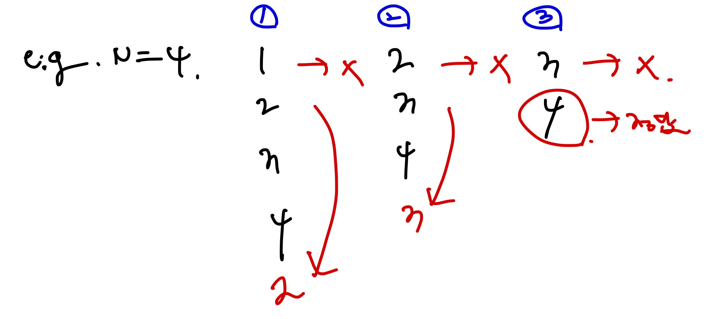

<!-- 제목으로 다음과 같은 내용으로 작성해주세요 ! -->
<!-- 📚 언어 : e.g. Javascript -> [JS], Python -> [Python]  -->
<!-- 📕 백준 : BOJ 문제번호/문제제목 e.g. BOJ 2577/숫자의 개수 -->
<!-- 📗 프로그래머스 : PRO 문제번호/문제제목 e.g. PRO 120812/최빈값 구하기 -->
<!-- 💁🏻 백준허브를 사용하시면 프로그래머스의 문제번호도 확인하실 수 있습니다 -->

# [JS] BOJ 2164/카드2

<!-- 아래에 # 을 지우고 문제 링크를 입력해주세요 ! -->

[문제 링크](https://www.acmicpc.net/problem/2164)

## Table of Contents

- [✍🏻 풀이](#풀이)
- [⏰ 소요시간](#소요시간)
- [🫠 어려웠던 점](#어려웠던-점)
- [😮 배운 점](#배운-점)
- [🤔 궁금한 점](#궁금한-점)

## 풀이

<!-- ```옆에 사용하는 언어를 기입하세요 e.g. javascript, python -->

큐를 사용해서 문제를 풀이하였다.

큐는 LinkedList 를 사용해 직접 구현해서 이를 풀었으며, 구현한 큐에 입력값 만큼의 카드를 넣었고, 반복문을 사용해 해당 조건을 구현했다.

조건을 그림으로 나타내면 다음과 같다.



우선 제일 앞(head)에 있는 값을 제거한 후, 두번째로 앞에 있는 값을 큐의 뒷(tail) 부분에 넣었다. 그런 다음 두번째 로 앞에 있는 값이 현재 제일 앞에 있기에 이를 제거해주는 방식으로 while 문을 설계했고, 해당 큐의 크기가 1이 되면 이를 종료시키도록 만들었다.

그래서 큐의 크기가 1일때 큐에 남아있는 값을 뽑아 이를 출력하는 식으로 구현했다.

```javascript
const input = +require('fs').readFileSync('/dev/stdin').toString().trim();

class Node {
  constructor(item) {
    this.item = item;
    this.next = null;
    this.prev = null;
  }
}

class Queue {
  constructor() {
    this.head = null;
    this.tail = null;
    this.length = 0;
  }

  push(item) {
    const newNode = new Node(item);

    if (!this.head) {
      this.head = newNode;
    } else {
      this.tail.next = newNode;
      newNode.prev = this.tail;
    }
    this.tail = newNode;
    this.length++;
  }

  getHead() {
    return this.head.item;
  }

  removeHead() {
    this.head = this.head.next;
    this.head.prev = null;
    this.length--;
  }

  getSize() {
    return this.length;
  }
}

function solution(n) {
  const queue = new Queue();

  for (let i = 1; i <= n; i++) queue.push(i);

  while (queue.getSize() > 1) {
    queue.removeHead();
    queue.push(queue.getHead());
    queue.removeHead();
  }

  return queue.getHead();
}

const answer = solution(input);
console.log(answer);
```

## 소요시간

30분

## 어려웠던 점

LinkedList를 통한 Queue 구현,, 공부 더 해보자 !

## 배운 점

## 궁금한 점
