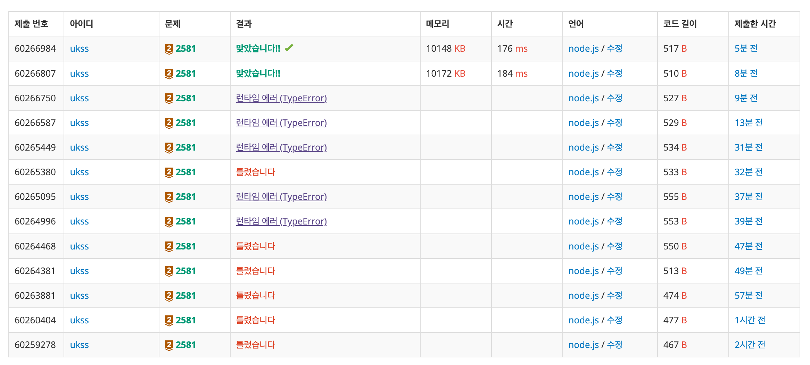

<!-- 제목으로 다음과 같은 내용으로 작성해주세요 ! -->
<!-- 📚 언어 : e.g. Javascript -> [JS], Python -> [Python]  -->
<!-- 📕 백준 : BOJ 문제번호/문제제목 e.g. BOJ 2577/숫자의 개수 -->
<!-- 📗 프로그래머스 : PRO 문제번호/문제제목 e.g. PRO 120812/최빈값 구하기 -->
<!-- 💁🏻 백준허브를 사용하시면 프로그래머스의 문제번호도 확인하실 수 있습니다 -->

# [JS] BOJ 2581/소수

<!-- 아래에 # 을 지우고 문제 링크를 입력해주세요 ! -->

[문제 링크](https://www.acmicpc.net/problem/2581)

## Table of Contents

- [✍🏻 풀이](#풀이)
- [⏰ 소요시간](#소요시간)
- [🫠 어려웠던 점](#어려웠던-점)
- [😮 배운 점](#배운-점)
- [🤔 궁금한 점](#궁금한-점)

## 풀이

<!-- ```옆에 사용하는 언어를 기입하세요 e.g. javascript, python -->

sosuCheck 라는 변수를 생성해서 n이 1일 경우 false, 그리고 n이 i로 나눠질 경우 false, 그렇지 않다면 true를 내보내는 소수 판별 알고리즘을 만들었다.

이를 M에서 N까지 꺼내주는 반복문에서 해당 알고리즘을 사용해서 값을 판별했고, 소수일 경우 배열에 담아주는 식으로 범위 내에 존재하는 소수들을 모았다.

`reduce()`를 사용해서 소수들의 총합, 그리고 `Math.min()`을 사용해서 최솟값을 구해냈으며, 범위 내의 소수 존재여부는 소수를 담아낸 배열의 길이로 판단하여 없을 경우 -1, 존재할 경우 총합, 최소값을 출력할 수 있도록 설계했다.

```javascript
const [M, N] = require('fs').readFileSync('/dev/stdin').toString().trim().split('\n').map(Number);

let sosu = [];

const sosuCheck = (n) => {
  if (n === 1) {
    return false;
  }
  for (let i = 2; i <= Math.sqrt(n); i++) {
    if (n % i === 0) {
      return false;
    }
  }
  return true;
};

for (let i = M; i <= N; i++) {
  sosuCheck(i) && sosu.push(i);
}

let sumResult = sosu.reduce((sum, cur) => sum + cur, 0);
let minResult = Math.min(...sosu);
console.log(sosu.length ? `${sumResult}\n${minResult}` : -1);
```

## 소요시간

15분

## 어려웠던 점

## 배운 점



사실 알고리즘은 틀린게 없었다고 생각했는데 계속해서 런타임 에러가 발생했다.

알고보니 `reduce()`를 사용할 때 초기값을 입력해주지 않아서 발생한 에러였다.

_코드를 유심히 보자 !!_

## 궁금한 점
