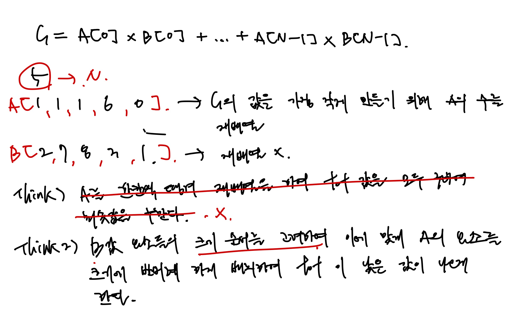
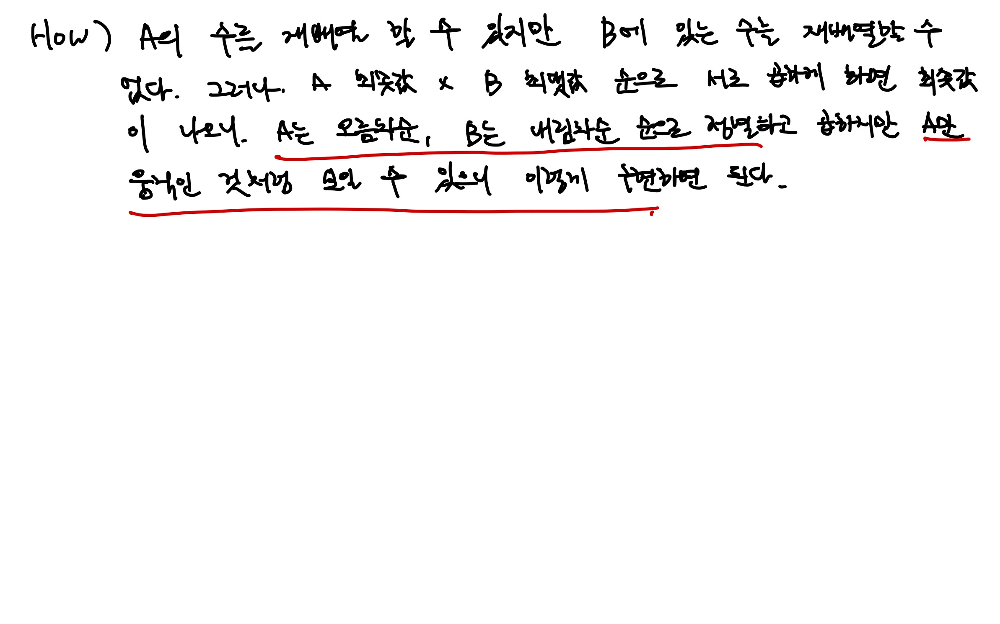

<!-- 제목으로 다음과 같은 내용으로 작성해주세요 ! -->
<!-- 📚 언어 : e.g. Javascript -> [JS], Python -> [Python]  -->
<!-- 📕 백준 : BOJ 문제번호/문제제목 e.g. BOJ 2577/숫자의 개수 -->
<!-- 📗 프로그래머스 : PRO 문제번호/문제제목 e.g. PRO 120812/최빈값 구하기 -->
<!-- 💁🏻 백준허브를 사용하시면 프로그래머스의 문제번호도 확인하실 수 있습니다 -->

# [JS] BOJ 1026/보물

<!-- 아래에 # 을 지우고 문제 링크를 입력해주세요 ! -->

[문제 링크](https://www.acmicpc.net/problem/1026)

## Table of Contents

-   [✍🏻 풀이](#풀이)
-   [⏰ 소요시간](#소요시간)
-   [🫠 어려웠던 점](#어려웠던-점)
-   [😮 배운 점](#배운-점)
-   [🤔 궁금한 점](#궁금한-점)

## 풀이

<!-- ```옆에 사용하는 언어를 기입하세요 e.g. javascript, python -->

다음 접근 방법을 통해 풀었다.




A와 B의 배열들의 요소를 서로 곱하는데 서로의 최소값 순서와 최대값 순서를 서로 곱하면 되겠다는 생각이 들어서 해당 접근방법으로 풀었다.

그래서 A배열을 오름차순 정렬, B 배열을 내림차순 정렬을 하여 곱을 해주어 최소값을 구했고, 이는 A 배열이 B 배열에 맞춰 A배열을 정렬한 후 곱한 것의 합으로 볼 수 있기에 가능하였다.

`B에 있는 수는 재배열하면 안된다` 라는 조건에 의해서 많은 생각을 했던 문제였던 것 같다.

```javascript
const [N, A, B] = require('fs')
    .readFileSync('/dev/stdin')
    .toString()
    .trim()
    .split('\n');

function solution(n, alist, blist) {
    const N = +n;
    const A = alist
        .split(' ')
        .map(Number)
        .sort((a, b) => a - b);
    const B = blist
        .split(' ')
        .map(Number)
        .sort((a, b) => b - a);

    let tot = 0;

    for (let i = 0; i < N; i++) {
        tot += A[i] * B[i];
    }

    return tot;
}

const answer = solution(N, A, B);
console.log(answer);
```

## 소요시간

1시간

## 어려웠던 점

## 배운 점

## 궁금한 점
