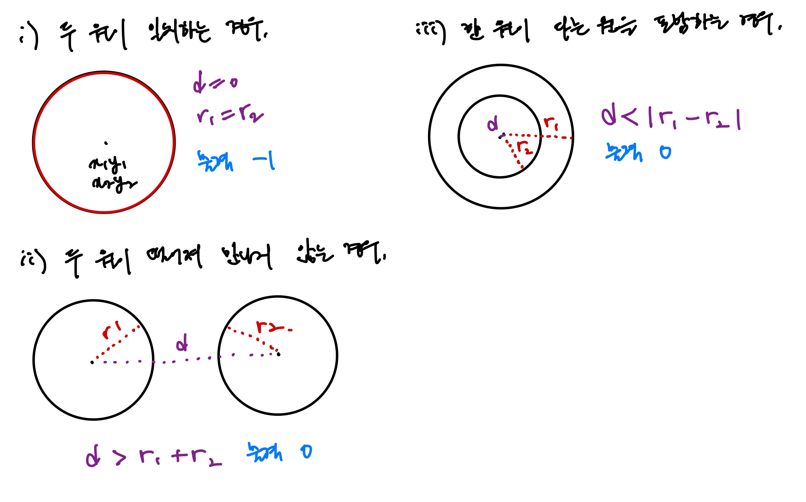
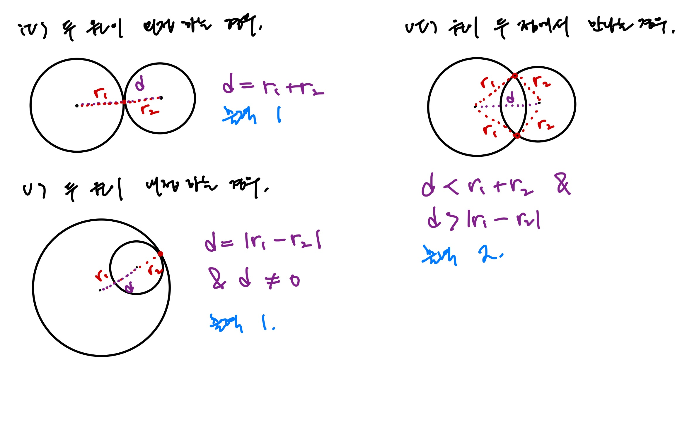

<!-- 제목으로 다음과 같은 내용으로 작성해주세요 ! -->
<!-- 📚 언어 : e.g. Javascript -> [JS], Python -> [Python]  -->
<!-- 📕 백준 : BOJ 문제번호/문제제목 e.g. BOJ 2577/숫자의 개수 -->
<!-- 📗 프로그래머스 : PRO 문제번호/문제제목 e.g. PRO 120812/최빈값 구하기 -->
<!-- 💁🏻 백준허브를 사용하시면 프로그래머스의 문제번호도 확인하실 수 있습니다 -->

# [JS] BOJ 1002/터렛

<!-- 아래에 # 을 지우고 문제 링크를 입력해주세요 ! -->

[문제 링크](https://www.acmicpc.net/problem/1002)

## Table of Contents

-   [✍🏻 풀이](#풀이)
-   [⏰ 소요시간](#소요시간)
-   [🫠 어려웠던 점](#어려웠던-점)
-   [😮 배운 점](#배운-점)
-   [🤔 궁금한 점](#궁금한-점)

## 풀이

<!-- ```옆에 사용하는 언어를 기입하세요 e.g. javascript, python -->





```javascript
const input = require('fs')
    .readFileSync('/dev/stdin')
    .toString()
    .trim()
    .split('\n')
    .slice(1)
    .map((el) => {
        const [x1, y1, r1, x2, y2, r2] = el.split(' ').map(Number);

        const p1 = { x: x1, y: y1 };
        const p2 = { x: x2, y: y2 };

        const d = distance(p1, p2);
        const spot = checkPoint(d, r1, r2);
        return spot;
    });

function distance(p1, p2) {
    return (p1.x - p2.x) ** 2 + (p1.y - p2.y) ** 2;
}

function checkPoint(d, r1, r2) {
    const sum = (r1 + r2) ** 2;
    const sub = (r1 - r2) ** 2;

    if (d < sum && d > sub) {
        return 2;
    } else if (d === sum || (d === sub && d !== 0)) {
        return 1;
    } else if (d > sum || d < sub) {
        return 0;
    } else if (d === 0) {
        if (r1 === r2) {
            return -1;
        } else {
            return 0;
        }
    }
}

console.log(input.join('\n'));
```

## 소요시간

2 일동안 고민하고 수정

## 어려웠던 점

고려해야할 경우의 수가 너무 많았다.

## 배운 점

## 궁금한 점
