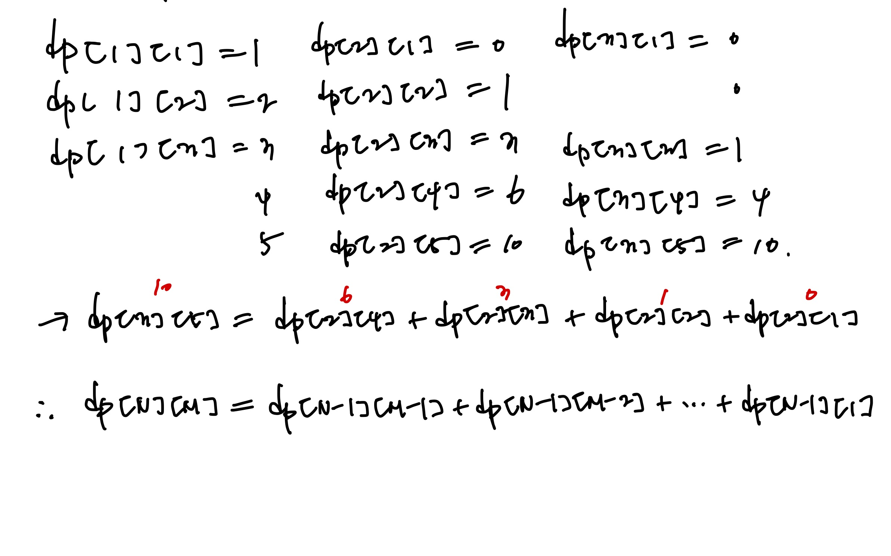

<!-- 제목으로 다음과 같은 내용으로 작성해주세요 ! -->
<!-- 📚 언어 : e.g. Javascript -> [JS], Python -> [Python]  -->
<!-- 📕 백준 : BOJ 문제번호/문제제목 e.g. BOJ 2577/숫자의 개수 -->
<!-- 📗 프로그래머스 : PRO 문제번호/문제제목 e.g. PRO 120812/최빈값 구하기 -->
<!-- 💁🏻 백준허브를 사용하시면 프로그래머스의 문제번호도 확인하실 수 있습니다 -->

# [JS] BOJ 1010/다리 놓기

<!-- 아래에 # 을 지우고 문제 링크를 입력해주세요 ! -->

[문제 링크](https://www.acmicpc.net/problem/1010)

## Table of Contents

-   [✍🏻 풀이](#풀이)
-   [⏰ 소요시간](#소요시간)
-   [🫠 어려웠던 점](#어려웠던-점)
-   [😮 배운 점](#배운-점)
-   [🤔 궁금한 점](#궁금한-점)

## 풀이

<!-- ```옆에 사용하는 언어를 기입하세요 e.g. javascript, python -->

다음 식을 통해 규칙을 얻어냈다.



이 식을 활용해서 배열을 만들어 값을 채운 후, 해당 배열의 값만 뽑아 이를 출력하였다.

```javascript
const [T, ...testCase] = require('fs').readFileSync('/dev/stdin').toString().trim().split('\n');
function solution(list) {
    const arr = [];
    for (const item of list) {
        const [N, M] = item.split(' ').map(Number);
        const dp = Array.from(Array(N + 1), () => Array(M + 1).fill(0));
        for (let i = 1; i <= N; i++) {
            for (let j = 1; j <= M; j++) {
                if (i === 1) {
                    // [1][j]
                    dp[i][j] = j; // 1,2,3,4,5....
                } else {
                    // [i][j]
                    if (i === j) {
                        dp[i][j] = 1;
                    } else if (i < j) {
                        for (let k = 1; k < j; k++) {
                            dp[i][j] += dp[i - 1][k];
                        }
                    }
                }
            }
        }
        arr.push(dp[N][M]);
    }
    return arr.join('\n');
}
const answer = solution(testCase);
console.log(answer);
```

## 소요시간

30분

## 어려웠던 점

## 배운 점

dp 문제는 처음 풀어보는데, 문제를 차근차근 읽어보니 공식을 이와 같이 유도할 수 있었다.

## 궁금한 점
