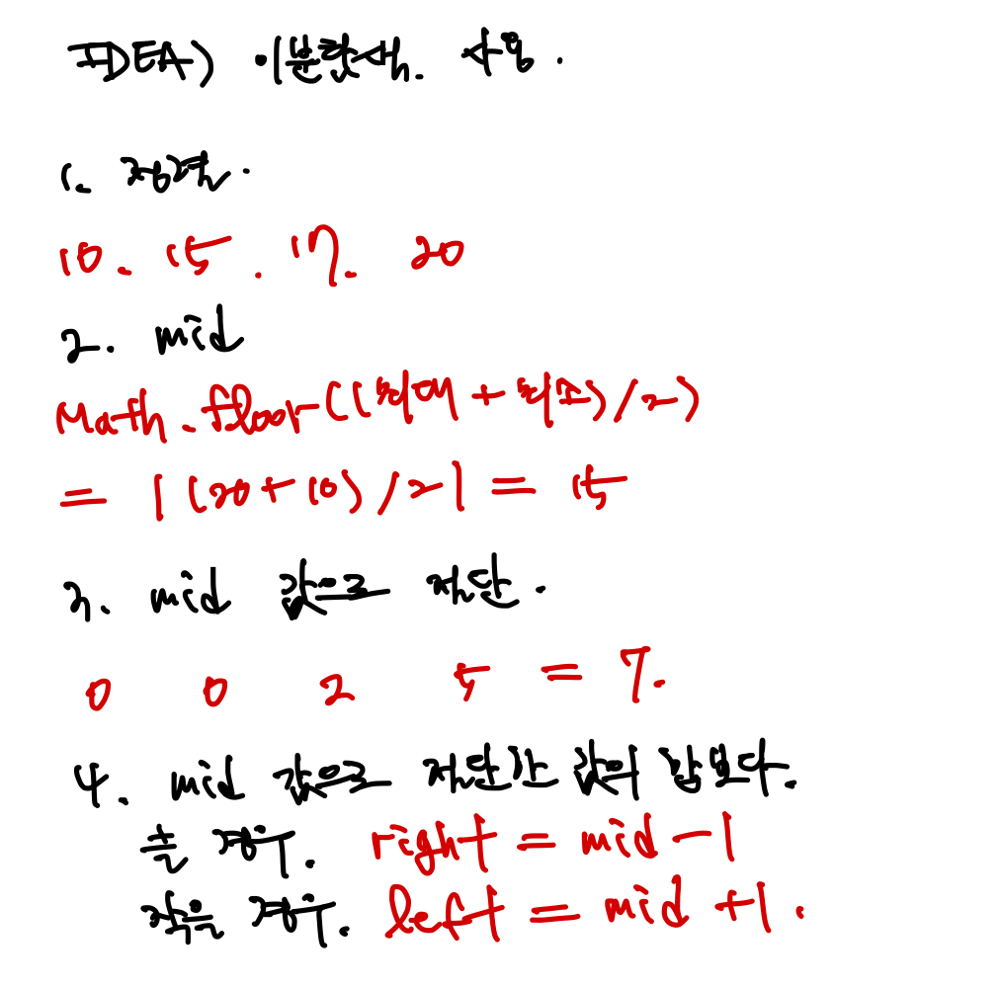

<!-- 제목으로 다음과 같은 내용으로 작성해주세요 ! -->
<!-- 📚 언어 : e.g. Javascript -> [JS], Python -> [Python]  -->
<!-- 📕 백준 : BOJ 문제번호/문제제목 e.g. BOJ 2577/숫자의 개수 -->
<!-- 📗 프로그래머스 : PRO 문제번호/문제제목 e.g. PRO 120812/최빈값 구하기 -->
<!-- 💁🏻 백준허브를 사용하시면 프로그래머스의 문제번호도 확인하실 수 있습니다 -->

# [JS] BOJ 2805/나무 자르기

<!-- 아래에 # 을 지우고 문제 링크를 입력해주세요 ! -->

[문제 링크](https://www.acmicpc.net/problem/2805)

## Table of Contents

-   [✍🏻 풀이](#풀이)
-   [⏰ 소요시간](#소요시간)
-   [🫠 어려웠던 점](#어려웠던-점)
-   [😮 배운 점](#배운-점)
-   [🤔 궁금한 점](#궁금한-점)

## 풀이

<!-- ```옆에 사용하는 언어를 기입하세요 e.g. javascript, python -->

이분 탐색으로 해결한 문제이다.

우선 이분 탐색을 위해 tree 배열을 오름차순 정렬을 해준 후, mid 값을 구해 mid 값 보다 큰 tree 들을 절단해준다. 이를 합한 sum 을 만들어 해당 값이 가져가려고 하는 나무의 길이 M 보다 크거나 같은지 비교한 후 맞을 경우 ans 값에 넣어준다. 이러한 조건을 만족한 ans 의 최댓값을 구해주어야 하기에 while 문 반복중에 계속 값을 덮어 씌우는 식으로 진행했다.

이후 이분 탐색이 완료되면 절단기에 설정할 수 있는 높이의 최댓값을 출력할 수 있게 된다.



그림에서는 left, right 로 적었지만, 구현에서는 start, end 로 바꿔 풀었다.

```javascript
const input = require('fs')
    .readFileSync('/dev/stdin')
    .toString()
    .trim()
    .split('\n');

const [NM, tree] = input.map((v) => v.split(' ').map(Number));
const [N, M] = NM;
tree.sort((a, b) => a - b);

let start = 0;
let end = tree[tree.length - 1];
let ans = 0;

while (start <= end) {
    let mid = Math.floor((start + end) / 2);
    let sum = 0;

    for (let x of tree) {
        if (x > mid) {
            sum += x - mid;
        }
    }

    if (sum >= M) {
        ans = mid;
        start = mid + 1;
    } else {
        end = mid - 1;
    }
}

console.log(ans);
```

## 소요시간

30분

## 어려웠던 점

## 배운 점

이분 탐색의 로직을 잘 이용하면 쉽게 풀 수 있었던 문제였다.

## 궁금한 점
