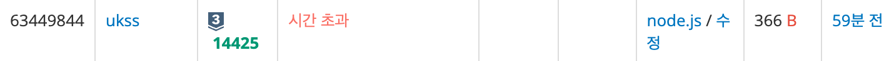

<!-- 제목으로 다음과 같은 내용으로 작성해주세요 ! -->
<!-- 📚 언어 : e.g. Javascript -> [JS], Python -> [Python]  -->
<!-- 📕 백준 : BOJ 문제번호/문제제목 e.g. BOJ 2577/숫자의 개수 -->
<!-- 📗 프로그래머스 : PRO 문제번호/문제제목 e.g. PRO 120812/최빈값 구하기 -->
<!-- 💁🏻 백준허브를 사용하시면 프로그래머스의 문제번호도 확인하실 수 있습니다 -->

# [JS] BOJ 14425/문자열 집합

<!-- 아래에 # 을 지우고 문제 링크를 입력해주세요 ! -->

[문제 링크](https://www.acmicpc.net/problem/14425)

## Table of Contents

-   [✍🏻 풀이](#풀이)
-   [⏰ 소요시간](#소요시간)
-   [🫠 어려웠던 점](#어려웠던-점)
-   [😮 배운 점](#배운-점)
-   [🤔 궁금한 점](#궁금한-점)

## 풀이

<!-- ```옆에 사용하는 언어를 기입하세요 e.g. javascript, python -->

처음에는 다음과 같이 풀었다.

```jsx
const [first, ...list] = require('fs').readFileSync('/dev/stdin').toString().trim().split('\n');
const [N, M] = first.split(' ').map(Number);

const S = list.splice(0, N);

let ans = 0;

for (let i = 0; i < M; i++) {
    const test = list[i];

    for (let j = 0; j < N; j++) {
        const check = S[j];

        test === check && ans++;
    }
}

console.log(ans);
```

그러나 다음과 같은 결과가 나왔다.



집합 S에 같은 문자열이 여러번 주어지는 경우가 없다는 조건을 놓쳤으며, 전체를 순회하며 검사를 하기에 시간 복잡도가 O(n)이 나와 시간 초과가 나온것 같다. 그래서 Set() 을 사용해서 중복 제거를 하였고, has() 를 사용해서 값만 존재하는 것 만 뽑아 있을 경우 ans 에 값을 더해 정답을 유도하였다. (시간 복잡도 O(1))

```javascript
const [first, ...list] = require('fs').readFileSync('/dev/stdin').toString().trim().split('\n');
const [N] = first.split(' ').map(Number);

const candidate = list.splice(0, N);
const set = new Set(candidate);

let ans = 0;

list.forEach((el) => {
    if (set.has(el)) {
        ans++;
    }
});

console.log(ans);
```

## 소요시간

1 시간

## 어려웠던 점

## 배운 점

Set() !!!

## 궁금한 점
