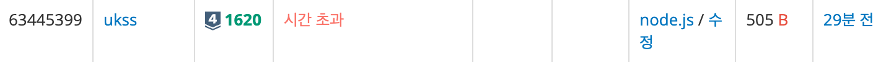

<!-- 제목으로 다음과 같은 내용으로 작성해주세요 ! -->
<!-- 📚 언어 : e.g. Javascript -> [JS], Python -> [Python]  -->
<!-- 📕 백준 : BOJ 문제번호/문제제목 e.g. BOJ 2577/숫자의 개수 -->
<!-- 📗 프로그래머스 : PRO 문제번호/문제제목 e.g. PRO 120812/최빈값 구하기 -->
<!-- 💁🏻 백준허브를 사용하시면 프로그래머스의 문제번호도 확인하실 수 있습니다 -->

# [JS] BOJ 1620/나는야 포켓몬 마스터 이다솜

<!-- 아래에 # 을 지우고 문제 링크를 입력해주세요 ! -->

[문제 링크](https://www.acmicpc.net/problem/1620)

## Table of Contents

-   [✍🏻 풀이](#풀이)
-   [⏰ 소요시간](#소요시간)
-   [🫠 어려웠던 점](#어려웠던-점)
-   [😮 배운 점](#배운-점)
-   [🤔 궁금한 점](#궁금한-점)

## 풀이

<!-- ```옆에 사용하는 언어를 기입하세요 e.g. javascript, python -->

처음에는 다음과 같이 풀었다.

```javascript
const [first, ...list] = require('fs').readFileSync('/dev/stdin').toString().trim().split('\n');
const [N, M] = first.split(' ').map(Number);
const question = list.splice(list.length - M, M).map((el) => {
    if (!isNaN(el)) {
        return Number(el);
    } else {
        return el;
    }
});

const ans = [];

for (let item of question) {
    if (typeof item === 'number') {
        ans.push(list[item - 1]);
    } else {
        ans.push(list.indexOf(item) + 1);
    }
}

console.log(ans.join('\n'));
```

그러나 다음과 같은 결과가 나왔다.



시간 초과가 발생한 이유는 시간복잡도가 O(n) 이 나와 제한된 시간을 넘긴 것 같다. 해쉬 테이블을 사용해서 이를 해결할 수 있었다. 다음 경우에는 배열 전체를 순회하는 것이 아니라, 키와 값이 짝을 이루어 일치한 것만 쏙 뽑아 값을 변화해줄 수 있기에 시간 복잡도를 O(1) 로 단축시킬 수 있었다.

```javascript
const [first, ...list] = require('fs').readFileSync('/dev/stdin').toString().trim().split('\n');
const [N, M] = first.split(' ').map(Number);

const numToKey = new Map();
const nameToKey = new Map();

for (let i = 0; i < N; i++) {
    numToKey.set(i + 1, list[i]);
    nameToKey.set(list[i], i + 1);
}

const question = list.splice(list.length - M, M).map((el) => {
    if (!isNaN(el)) {
        return numToKey.get(+el);
    } else {
        return nameToKey.get(el);
    }
});

console.log(question.join('\n'));
```

## 소요시간

1 시간

## 어려웠던 점

## 배운 점

해쉬 테이블을 사용해서 더욱 빠르게 원하는 값을 도출해낼 수 있었다 !

## 궁금한 점
